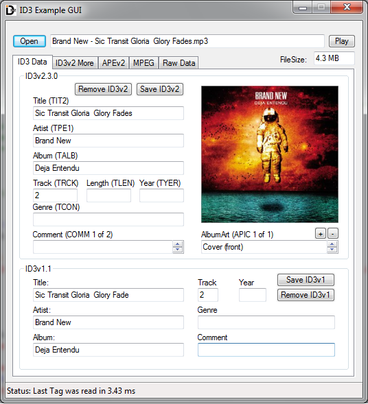

###ID3_UDF

- **ID3.au3 UDF Description:**<Enter>
-- Reads ID3v1.0, ID3v1.1, ID3v1.1+, ID3v2.2, ID3v2.3, ID3v2.4, APEv2 and MPEG frame header<Enter>
-- Writes ID3v1.1, ID3v2.3, ID3v2.4

- **Latest Version v3.4 20120610**<Enter>
-- AutoIt Version Required: 23rd December, 2011 - v3.3.8.0 of AutoIt ID3 functions only works with .mp3 files

- **Notes:**<Enter>
-- More info on the ID3 format can be found at http://www.id3.org/Developer_Information and http://en.wikipedia.org/wiki/ID3
-- More info on the APE tag format can be found at http://wiki.hydrogenaudio.org/index.php?title=APEv2_specification
-- If you only care about getting the basic info ie. Album, Artist, Track and Song Title then look into using Udf: Get Extended FIle Properties
-- More ID3 implementations http://www.id3.org/Implementations

- **Changes in latest version (see files for all changes):**<Enter>
-- *ID3.au3 (06/10/2012)* [ID3_v3.4.1.au3]
-- *ID3_Example_GUI.au3 (06/10/2012)* [ID3_Example_GUI_v3.4.1.au3]
-- *ID3_SimpleExamples.au3 (06/10/2012)* [ID3_SimpleExamples_v3.4.au3]
 -- I have realized that the GUI example has become overly complex, so I have added this file to help show how I intended ID3.au3   to be used.
  

**Simple Read Tag Example:**
```AutoIt
$Filename = FileOpenDialog ( "Select Mp3 File", "", "Muisc (*.mp3)")
$sTagInfo = _ID3ReadTag($Filename)
MsgBox(0,"TagInfo",$sTagInfo)
MsgBox(0,"ID3v1 Title",_ID3GetTagField("Title")) ;Title from ID3v1
MsgBox(0,"ID3v2 Title",_ID3GetTagField("TIT2")) ;Title from ID3v2
```

**Simple Write Tag Example:**
```AutoIt
$Filename = FileOpenDialog( "Select Mp3 File", "", "Muisc (*.mp3)")
$sTagInfo = _ID3ReadTag($Filename)
_ID3SetTagField("COMM","TEST COMMENT - ID3v2 Comment Tag")
_ID3WriteTag($Filename)
```
  
  
- **Latest versions of the specification**<Enter>
-- ID3v2.3TagSpec.pdf<Enter>
-- ID3v2.4TagSpec.pdf

**Example_GUI Screenshot**




